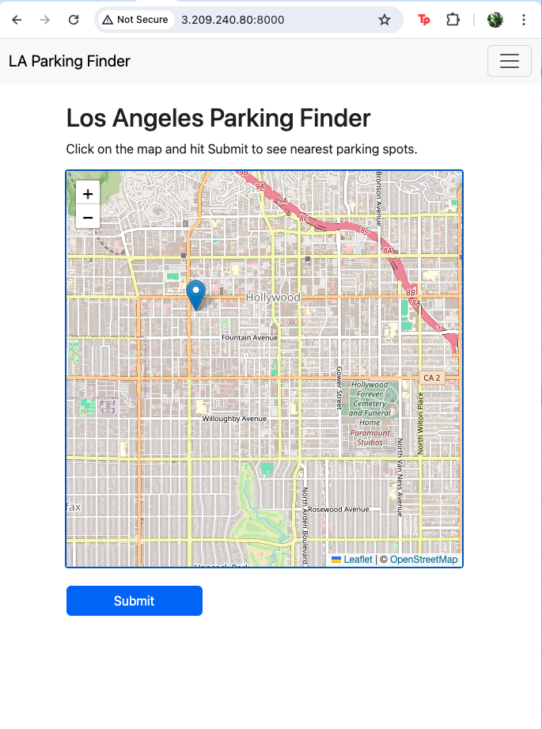

To access the app, go to https://3.209.240.80:8000/. Message me on the username / password. 

Once logged in, the app will provide a map, and you can point in the map. 



Click submit, and it will show the nearby parking spots and nearby business spots.


The app will provide parking spots with near : the general location of where you want to park, when you want to park, and the radius of parking (setting this to either 1 mile or 0.5 mile for simplicity). Then it will use data from the Lacity website to provide you the top parking areas that most likely has parking, and the top business areas that might have parking.


Datasets used:
	
1. Active Businesses  
	- https://data.lacity.org/Administration-Finance/Listing-of-Active-Businesses/6rrh-rzua
	- Will only pick restaurants, parks, groceries, and related items. This dataset has a column called "NAICS" which shows the type of business a record is. The NAICS (https://www.census.gov/naics/?58967?yearbck=1997) assigns codes to categories of business, and I'll only get these categories:
	```
	42* 		Wholesale Trade
	44*-45* 	Retail Trade
	71* 		Arts Entertainment Recrration
	81* 		Other Services (except Public Administration)
	```


2. Parking
	- https://data.lacity.org/Transportation/LADOT-Metered-Parking-Inventory-Policies/s49e-q6j2 (has SpaceID, LatLong)
	- https://data.lacity.org/Transportation/LADOT-Parking-Meter-Occupancy/e7h6-4a3e (has SpaceID, Time, OccupancyState) (merge with #1)

