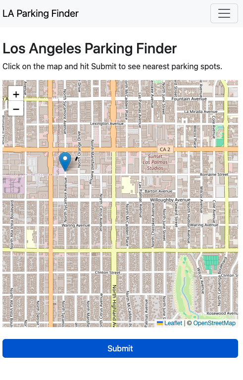
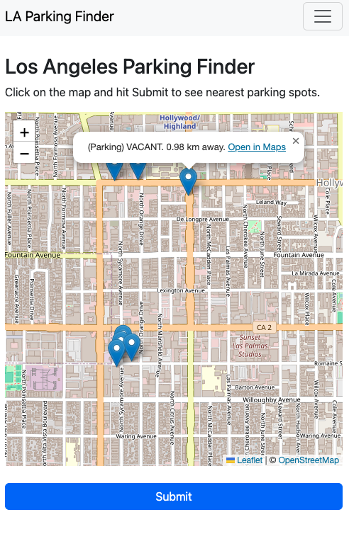

To access the app, go to https://3.209.240.80:8000/. Message me on the username / password. 

Once logged in, the app will provide a map, and you can point in the map. 



Click submit, and it will show the nearby parking spots and nearby business spots.




Datasets used:
	
1. Active Businesses  
	- https://data.lacity.org/Administration-Finance/Listing-of-Active-Businesses/6rrh-rzua
	- Will only pick restaurants, parks, groceries, and related items. This dataset has a column called "NAICS" which shows the type of business a record is. The NAICS (https://www.census.gov/naics/?58967?yearbck=1997) assigns codes to categories of business, and I'll only get these categories:
	```
	42* 		Wholesale Trade
	44*-45* 	Retail Trade
	71* 		Arts Entertainment Recrration
	81* 		Other Services (except Public Administration)
	```
	- The dataset has around 500,000 rows but I only read 100,000 rows to save costs.


2. Parking
	- https://data.lacity.org/Transportation/LADOT-Metered-Parking-Inventory-Policies/s49e-q6j2 (has SpaceID, LatLong)
	- https://data.lacity.org/Transportation/LADOT-Parking-Meter-Occupancy/e7h6-4a3e (has SpaceID, Time, OccupancyState) (merge with #1)


How to run this tool locally:
1. Make sure the infrastructure is set up. Terraform code to set it up is in https://github.com/jacobatorres/terraform/tree/main/apartment_finder_airflow
	- git clone that repo, then run go to github_repos/terraform/apartment_finder_airflow/examples/basic. Then run `terraform init; terraform plan -out theplan -var-file="secrets.tfvars"; terraform apply`
	- the terraform will ask for your machine's local IP address, you can put that in the secrets.tfvars file. Here's what my secrets.tfvars looked like:

	app_token_password   = "<REDACTED>"
	data_lacity_password = "<REDACTED>"
	db_username          = "<REDACTED>"
	db_password          = "<REDACTED>"
	my_ip                = "<REDACTED>"


2. Populate the database with business values.
	- run python3 01_create_tables.py to create the tables
	- run python3 02_populate_business_location_table.py, python3 02_populate_business_location_table.py to populate the business_location and parking_location tables. The parking_real_time table is populated by Airflow / MWAA. Feel free to adjust the values there, having too many data is costly for a pet project. 
	- run python3 03_create_indexes.py to create the indexes. It's recommended to import data first before running the index.

3. Make sure you can access the DAGs
	- go to AWS > Amazon Managed Workflows for Apache Airflow (MWAA) > Environment 
	- then click on the UI console
	- from there, activate the two dags that save_new_parking_data and delete_parking_data
	- verify via the logs or via an RDS client (e.g. DBeaver) that it populates the table / deletes the table.

4. Make sure you can access the webapp
	- from github_repos/los_angeles_parking_finder, cd webapp
	- python3 manage.py migrate (creates the meta tables)
	- python3 manage.py createsuperuser (creates admin record)
	- python3 manage.py runserver (runs server in local)
	- accessing http://127.0.0.1:8000/ via the browser should show a login screen. Use credentials set up in the python3 manage.py createsuperuser command to log in.


